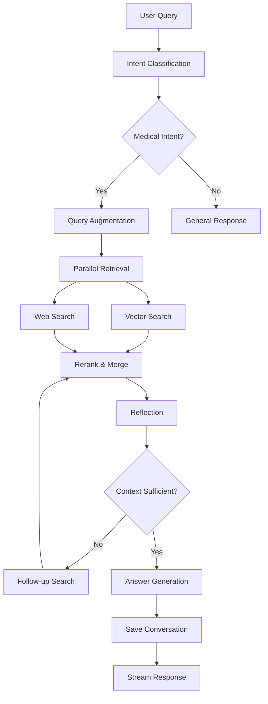

# Drug Agentic Chatbot

A sophisticated agentic chatbot system for drug-related queries using RAG (Retrieval-Augmented Generation) and multi-agent architecture.

## Architecture

The system is built with a modular architecture consisting of:

- **Database Layer**: Vector database (Milvus) and metadata database (PostgreSQL)
- **Tools & Services**: Core algorithms and LLM services
- **Worker Nodes**: High-level business logic workers
- **Workflows**: LangGraph-based state machines for complex processes
- **API Gateway**: FastAPI endpoints for external access

## Features

- 🤖 **Multi-Agent System**: Specialized workers for different tasks
- 🧠 **RAG (Retrieval-Augmented Generation)**: Combines vector search with web search
- 🔄 **Iterative Reflection**: Self-improving context with follow-up queries
- 🌐 **Web Integration**: Real-time web search for latest information
- 💬 **Streaming Responses**: Real-time answer generation
- 🏥 **Medical Domain**: Specialized for drug and healthcare information
- 🌍 **Multilingual**: Vietnamese and English support

## Prerequisites

- Python 3.9+
- Docker and Docker Compose
- At least 8GB RAM (for local LLM models)
- 10GB+ free disk space (for models and databases)

## Quick Start

### 1. **Setup Environment**
```bash
cd drug-agentic-chatbot
python -m venv venv
source venv/bin/activate  # On Windows: venv\Scripts\activate
pip install -r requirements.txt
```

### 2. **Start Databases**
```bash
cd database
docker-compose up -d
```

### 3. **Configure Environment**
Copy `.env` file and adjust settings as needed:
```bash
cp .env.example .env
# Edit .env with your configurations
```

### 4. **Index Knowledge Base**
```bash
python -c "
from core import Orchestrator
orchestrator = Orchestrator()
result = orchestrator.run_indexing('data/knowledge_base.csv')
print(f'Indexed {result[\"document_count\"]} documents')
"
```

### 5. **Start API Server**
```bash
python run_api.py
# Or using uvicorn directly:
# uvicorn api.main:app --reload --host 0.0.0.0 --port 8000
```

### 6. **Test the API**
```bash
python test_api.py
```

## API Endpoints

### **Documentation**
- **Swagger UI**: http://localhost:8000/docs
- **ReDoc**: http://localhost:8000/redoc

### **Main Endpoints**
- `POST /qa` - Question & Answer
- `POST /qa/stream` - Streaming Q&A 
- `POST /index` - Index knowledge base
- `GET /health` - Health check
- `GET /status` - System status

### **Example Usage**

#### **Q&A Request**
```bash
curl -X POST "http://localhost:8000/qa" \
     -H "Content-Type: application/json" \
     -d '{
       "query": "Tác dụng phụ của paracetamol là gì?",
       "user_id": "user123",
       "conversation_id": "conv456"
     }'
```

#### **Streaming Q&A**
```bash
curl -X POST "http://localhost:8000/qa/stream" \
     -H "Content-Type: application/json" \
     -d '{
       "query": "Paracetamol có tương tác với thuốc nào?",
       "user_id": "user123"
     }'
```

#### **Index Knowledge Base**
```bash
curl -X POST "http://localhost:8000/index" \
     -H "Content-Type: application/json" \
     -d '{"csv_file_path": "data/knowledge_base.csv"}'
```

## Project Structure

```
drug-agentic-chatbot/
├── api/                    # FastAPI gateway
│   ├── main.py            # Main API application
│   └── __init__.py
├── core/                   # Orchestrator and workflows
│   ├── orchestrator.py    # Main coordinator
│   └── workflows/         # LangGraph workflows
├── database/              # Database managers
│   ├── postgres_manager.py
│   ├── milvus_manager.py
│   └── docker-compose.yml
├── tools_services/        # Core tools and LLM services
│   ├── embedding_tool.py
│   ├── rerank_tool.py
│   ├── vector_search_tool.py
│   ├── web_search_tool.py
│   └── llm_services/
├── workers/               # Business logic workers
│   ├── intent_classification_worker.py
│   ├── query_augmentation_worker.py
│   ├── retrieval_worker.py
│   ├── reflection_worker.py
│   ├── q_and_a_worker.py
│   ├── save_conversation_worker.py
│   └── indexing_worker.py
├── data/                  # Knowledge base data
├── run_api.py            # API startup script
├── test_api.py           # API test script
└── requirements.txt      # Dependencies
```

## Development Status

✅ **Phase 1**: Database foundation and basic structure  
✅ **Phase 2**: Tools and services implementation  
✅ **Phase 3**: Worker nodes development  
✅ **Phase 4**: Workflow orchestration  
✅ **Phase 5**: API gateway and integration  

## Workflow Process



## Models Used

- **Embedding**: `sentence-transformers/paraphrase-multilingual-mpnet-base-v2`
- **Reranking**: `jinaai/jina-reranker-v2-base-multilingual`
- **Query Augmentation**: `google/flan-t5-base`
- **Web Summarization**: `google/flan-t5-large`
- **Reflection**: `Qwen/Qwen2.5-1.5B-Instruct`
- **Final Answer**: `MedGemma3-4b-it`

All models run locally with 4-bit quantization for efficiency.

## Production Deployment

### **Using Docker**
```bash
# Build image
docker build -t drug-agentic-chatbot .

# Run with docker-compose
docker-compose up -d
```

### **Using Gunicorn**
```bash
pip install gunicorn
gunicorn api.main:app -w 4 -k uvicorn.workers.UvicornWorker --bind 0.0.0.0:8000
```

## Monitoring & Logging

- Health check endpoint: `/health`
- Comprehensive logging throughout the system
- Performance metrics in API responses
- Error handling with detailed messages

## Contributing

1. Fork the repository
2. Create a feature branch
3. Make your changes
4. Add tests
5. Submit a pull request

## License

MIT License
